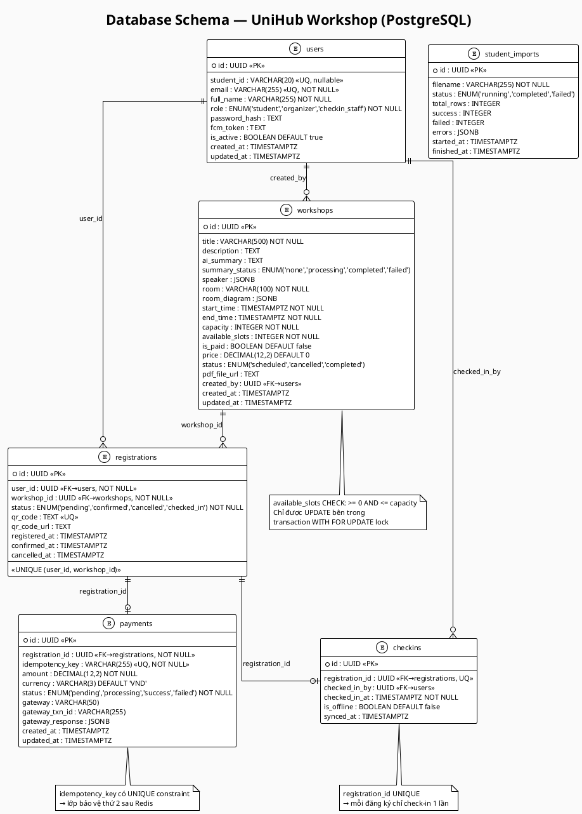

# UniHub Workshop — Technical Design

## Kiến trúc tổng thể
<!-- Mô tả architectural style được chọn và lý do.
     Hệ thống gồm những thành phần nào? Chúng giao tiếp với nhau như thế nào? -->

## C4 Diagram

### Level 1 — System Context
<!-- Sơ đồ: UniHub Workshop + actors + hệ thống ngoài -->
```plantuml
@startuml c4_level1_system_context
!include https://raw.githubusercontent.com/plantuml-stdlib/C4-PlantUML/master/C4_Context.puml

LAYOUT_WITH_LEGEND()

title System Context — UniHub Workshop

Person(student, "Sinh viên", "Xem lịch workshop, đăng ký,\nnhận QR, check-in")
Person(organizer, "Ban tổ chức", "Tạo và quản lý workshop,\nxem thống kê, upload PDF")
Person(checkin_staff, "Nhân sự check-in", "Quét mã QR tại cửa phòng\n(hỗ trợ offline)")

System(unihub, "UniHub Workshop", "Số hóa toàn bộ quy trình từ\nđăng ký đến check-in sự kiện")

System_Ext(payment_gw, "Payment Gateway", "Xử lý thanh toán workshop có phí\n(VNPay / Stripe sandbox)")
System_Ext(llm_api, "LLM API", "Tạo bản tóm tắt AI từ nội dung PDF\n(OpenAI / Gemini)")
System_Ext(email_svc, "Email Service", "Gửi email xác nhận đăng ký\nvà thông báo sự kiện (SendGrid)")
System_Ext(fcm, "Push Notification", "Gửi thông báo đẩy đến\nthiết bị sinh viên (FCM)")
System_Ext(legacy_sis, "Student Info System\n(Legacy)", "Hệ thống quản lý sinh viên hiện tại\nChỉ export CSV định kỳ ban đêm")

Rel(student, unihub, "Xem workshop, đăng ký,\nnhận QR")
Rel(organizer, unihub, "Quản lý workshop,\nxem thống kê")
Rel(checkin_staff, unihub, "Quét QR, check-in\n(online + offline)")

Rel(unihub, payment_gw, "Xử lý thanh toán\ncó phí", )
Rel(unihub, llm_api, "Gửi nội dung PDF\nđể tóm tắt")
Rel(unihub, email_svc, "Gửi email\nxác nhận")
Rel(unihub, fcm, "Gửi push\nnotification")
Rel(legacy_sis, unihub, "Export file CSV\nsinh viên (đêm)")

@enduml
```


### Level 2 — Container
<!-- Sơ đồ: web app, mobile app, backend API, database, message broker, ... -->

```plantuml
@startuml Level 2 - Container Diagram
!include https://raw.githubusercontent.com/plantuml-stdlib/C4-PlantUML/master/C4_Container.puml

LAYOUT_TOP_DOWN()
LAYOUT_WITH_LEGEND()

' Actors
Person(student, "Sinh viên", "Xem lịch workshop, đăng ký,\nnhận QR, check-in")
Person(organizer, "Ban tổ chức", "Tạo và quản lý workshop,\nxem thống kê, upload PDF")
Person(checkin_staff, "Nhân sự check-in", "Quét mã QR tại cửa phòng\n(hỗ trợ offline)")

Container_Boundary(c1, "UniHub Workshop System") {
    
    ' Row 1: SPAs
    Container(spa_org, "Admin UI", "React", "Quản lý workshop")
    Container(spa_std, "Student UI", "React", "Tham gia workshop")
    Container(spa_cie, "Check-in UI", "React", "Xác nhận sinh viên")

    ' Row 2: Backend (Đứng riêng biệt)
    Container(backend, "Backend API", "Node.js, Express", "Cung cấp JSON/HTTP API")

    ' Row 3: Internal Services & Queue
    ContainerQueue(mq, "Message Queue", "BullMQ", "Hàng đợi xử lý")
    Container(qr_consumer, "QR Worker", "Node.js", "Tạo mã QR")
    Container(email_consumer, "Email Worker", "Node.js", "Xử lý gửi mail")
    Container(csv_service, "CSV Import", "Node.js", "Nhập file CSV")

    ' Row 4: Databases (Nằm cùng hàng)
    ContainerDb(postgresql, "PostgreSQL", "SQL DB", "Dữ liệu chính, Workshop, Invoice")
    ContainerDb(redis, "Redis", "In-memory", "Caching & Rate limit")
}

' External Services (Phía dưới)
Container_Ext(ai_service, "AI Service", "Gemini, ...")
Container_Ext(email_service, "Email Service", "Gửi mail thực tế")
Container_Ext(std_export, "Student Data Source", "Hệ thống quản lý sinh viên")

' Relationships: Actors to UI
Rel(organizer, spa_org, "Sử dụng")
Rel(student, spa_std, "Sử dụng")
Rel(checkin_staff, spa_cie, "Sử dụng")

' UI to Backend (Tất cả hội tụ về Backend)
Rel(spa_org, backend, "Gọi", "HTTPS/JSON")
Rel(spa_std, backend, "Gọi", "HTTPS/JSON")
Rel(spa_cie, backend, "Gọi", "HTTPS/JSON")

' Backend to Queue and Logic
backend -down-> mq : "Đưa việc vào"
backend -down-> ai_service : "Yêu cầu tóm tắt"

' Backend to DBs (Tạo hàng riêng cho DB)
backend -down-> postgresql : "Đọc/Ghi"
backend -down-> redis : "Cache"

' Workers logic
Rel(qr_consumer, mq, "Lấy task")
Rel(qr_consumer, postgresql, "Cập nhật QR")

Rel(email_consumer, mq, "Lấy task")
Rel(email_consumer, email_service, "Gửi qua")
Rel(email_service, student, "Gửi mail", "SMTP")

Rel(csv_service, std_export, "Lấy file từ")
Rel(csv_service, postgresql, "Lưu dữ liệu")

' Layout Adjustments to force rows
Lay_R(spa_org, spa_std)
Lay_R(spa_std, spa_cie)

Lay_R(mq, qr_consumer)
Lay_R(qr_consumer, email_consumer)
Lay_R(email_consumer, csv_service)

Lay_R(postgresql, redis)

@enduml
```

## High-Level Architecture Diagram
<!-- Sơ đồ luồng dữ liệu, đặc biệt tại các điểm tích hợp và luồng check-in offline -->

## Thiết kế cơ sở dữ liệu
<!-- Loại database, lý do lựa chọn, schema các entity chính -->
### Lựa chọn: PostgreSQL (chính) + Redis (cache & queue)

**Lý do chọn PostgreSQL:**
- Dữ liệu workshop, đăng ký, thanh toán có **quan hệ chặt chẽ** — foreign key, JOIN là tự nhiên.
- Cần **ACID transaction** để đảm bảo không oversell (`SELECT ... FOR UPDATE`).
- Hỗ trợ `JSONB` cho metadata linh hoạt (sơ đồ phòng, lỗi CSV).



## Thiết kế kiểm soát truy cập
<!-- Mô hình phân quyền, các nhóm người dùng, cách kiểm tra quyền tại từng điểm truy cập -->
Ba role cố định với tập quyền tách biệt hoàn toàn:

| Role | Quyền |
|------|-------|
| `student` | Xem workshop, đăng ký, xem đăng ký của chính mình |
| `organizer` | Tất cả quyền student + tạo/sửa/hủy workshop, xem thống kê, upload PDF |
| `checkin_staff` | Chỉ endpoint quét QR và sync check-in |

## Thiết kế các cơ chế bảo vệ hệ thống

### Kiểm soát tải đột biến
<!-- Giải pháp, thuật toán, ngưỡng, hành vi khi vượt ngưỡng -->

### Xử lý cổng thanh toán không ổn định
<!-- Giải pháp, các trạng thái, ngưỡng kích hoạt, hành vi khi lỗi -->

### Chống trừ tiền hai lần
<!-- Cơ chế, nơi lưu trữ, TTL, luồng xử lý khi phát hiện trùng lặp -->

## Các quyết định kỹ thuật quan trọng (ADR)
<!-- Với mỗi quyết định lớn: lựa chọn gì, tại sao, đánh đổi gì.
     Ví dụ: SQL vs NoSQL, JWT vs Session, Kafka vs RabbitMQ, ... -->
