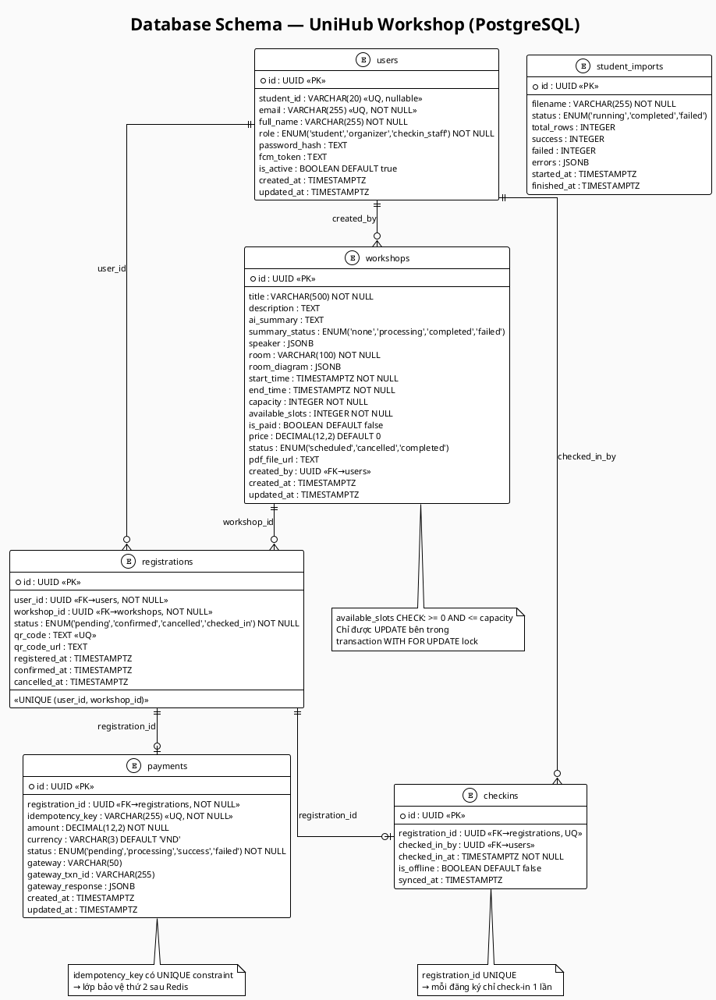

# UniHub Workshop — Technical Design

## Kiến trúc tổng thể
<!-- Mô tả architectural style được chọn và lý do.
     Hệ thống gồm những thành phần nào? Chúng giao tiếp với nhau như thế nào? -->

## C4 Diagram

### Level 1 — System Context
<!-- Sơ đồ: UniHub Workshop + actors + hệ thống ngoài -->
```plantuml
@startuml c4_level1_system_context
!include https://raw.githubusercontent.com/plantuml-stdlib/C4-PlantUML/master/C4_Context.puml

LAYOUT_WITH_LEGEND()

title System Context — UniHub Workshop

Person(student, "Sinh viên", "Xem lịch workshop, đăng ký,\nnhận QR, check-in")
Person(organizer, "Ban tổ chức", "Tạo và quản lý workshop,\nxem thống kê, upload PDF")
Person(checkin_staff, "Nhân sự check-in", "Quét mã QR tại cửa phòng\n(hỗ trợ offline)")

System(unihub, "UniHub Workshop", "Số hóa toàn bộ quy trình từ\nđăng ký đến check-in sự kiện")

System_Ext(payment_gw, "Payment Gateway", "Xử lý thanh toán workshop có phí\n(VNPay / Stripe sandbox)")
System_Ext(llm_api, "LLM API", "Tạo bản tóm tắt AI từ nội dung PDF\n(OpenAI / Gemini)")
System_Ext(email_svc, "Email Service", "Gửi email xác nhận đăng ký\nvà thông báo sự kiện (SendGrid)")
System_Ext(fcm, "Push Notification", "Gửi thông báo đẩy đến\nthiết bị sinh viên (FCM)")
System_Ext(legacy_sis, "Student Info System\n(Legacy)", "Hệ thống quản lý sinh viên hiện tại\nChỉ export CSV định kỳ ban đêm")

Rel(student, unihub, "Xem workshop, đăng ký,\nnhận QR")
Rel(organizer, unihub, "Quản lý workshop,\nxem thống kê")
Rel(checkin_staff, unihub, "Quét QR, check-in\n(online + offline)")

Rel(unihub, payment_gw, "Xử lý thanh toán\ncó phí", )
Rel(unihub, llm_api, "Gửi nội dung PDF\nđể tóm tắt")
Rel(unihub, email_svc, "Gửi email\nxác nhận")
Rel(unihub, fcm, "Gửi push\nnotification")
Rel(legacy_sis, unihub, "Export file CSV\nsinh viên (đêm)")

@enduml
```

### Level 2 — Container
<!-- Sơ đồ: web app, mobile app, backend API, database, message broker, ... -->

```plantuml
@startuml Level 2 - Container Diagram
!include https://raw.githubusercontent.com/plantuml-stdlib/C4-PlantUML/master/C4_Container.puml

LAYOUT_TOP_DOWN()
LAYOUT_WITH_LEGEND()

' Actors
Person(student, "Sinh viên", "Xem lịch workshop, đăng ký,\nnhận QR, check-in")
Person(organizer, "Ban tổ chức", "Tạo và quản lý workshop,\nxem thống kê, upload PDF")
Person(checkin_staff, "Nhân sự check-in", "Quét mã QR tại cửa phòng\n(hỗ trợ offline)")

Container_Boundary(c1, "UniHub Workshop System") {
    
    ' Row 1: SPAs
    Container(spa_org, "Admin UI", "React", "Quản lý workshop")
    Container(spa_std, "Student UI", "React", "Tham gia workshop")
    Container(spa_cie, "Check-in UI", "React", "Xác nhận sinh viên")

    ' Row 2: Backend (Đứng riêng biệt)
    Container(backend, "Backend API", "Node.js, Express", "Cung cấp JSON/HTTP API")

    ' Row 3: Internal Services & Queue
    ContainerQueue(mq, "Message Queue", "BullMQ", "Hàng đợi xử lý")
    Container(qr_consumer, "QR Worker", "Node.js", "Tạo mã QR")
    Container(email_consumer, "Email Worker", "Node.js", "Xử lý gửi mail")
    Container(csv_service, "CSV Import", "Node.js", "Nhập file CSV")

    ' Row 4: Databases (Nằm cùng hàng)
    ContainerDb(postgresql, "PostgreSQL", "SQL DB", "Dữ liệu chính, Workshop, Invoice")
    ContainerDb(redis, "Redis", "In-memory", "Caching & Rate limit")
}

' External Services (Phía dưới)
Container_Ext(ai_service, "AI Service", "Gemini, ...")
Container_Ext(email_service, "Email Service", "Gửi mail thực tế")
Container_Ext(std_export, "Student Data Source", "Hệ thống quản lý sinh viên")

' Relationships: Actors to UI
Rel(organizer, spa_org, "Sử dụng")
Rel(student, spa_std, "Sử dụng")
Rel(checkin_staff, spa_cie, "Sử dụng")

' UI to Backend (Tất cả hội tụ về Backend)
Rel(spa_org, backend, "Gọi", "HTTPS/JSON")
Rel(spa_std, backend, "Gọi", "HTTPS/JSON")
Rel(spa_cie, backend, "Gọi", "HTTPS/JSON")

' Backend to Queue and Logic
backend -down-> mq : "Đưa việc vào"
backend -down-> ai_service : "Yêu cầu tóm tắt"

' Backend to DBs (Tạo hàng riêng cho DB)
backend -down-> postgresql : "Đọc/Ghi"
backend -down-> redis : "Cache"

' Workers logic
Rel(qr_consumer, mq, "Lấy task")
Rel(qr_consumer, postgresql, "Cập nhật QR")

Rel(email_consumer, mq, "Lấy task")
Rel(email_consumer, email_service, "Gửi qua")
Rel(email_service, student, "Gửi mail", "SMTP")

Rel(csv_service, std_export, "Lấy file từ")
Rel(csv_service, postgresql, "Lưu dữ liệu")

' Layout Adjustments to force rows
Lay_R(spa_org, spa_std)
Lay_R(spa_std, spa_cie)

Lay_R(mq, qr_consumer)
Lay_R(qr_consumer, email_consumer)
Lay_R(email_consumer, csv_service)

Lay_R(postgresql, redis)

@enduml
```

## High-Level Architecture Diagram
<!-- Sơ đồ luồng dữ liệu, đặc biệt tại các điểm tích hợp và luồng check-in offline -->

## Thiết kế cơ sở dữ liệu
<!-- Loại database, lý do lựa chọn, schema các entity chính -->
### Lựa chọn: PostgreSQL (chính) + Redis (cache & queue)

**Lý do chọn PostgreSQL:**
- Dữ liệu workshop, đăng ký, thanh toán có **quan hệ chặt chẽ** — foreign key, JOIN là tự nhiên.
- Cần **ACID transaction** để đảm bảo không oversell (`SELECT ... FOR UPDATE`).
- Hỗ trợ `JSONB` cho metadata linh hoạt (sơ đồ phòng, lỗi CSV).

```plantuml
@startuml database_erd
!theme plain
skinparam backgroundColor #FAFAFA
skinparam defaultFontSize 11
skinparam linetype ortho

title Database Schema — UniHub Workshop (PostgreSQL)

entity "users" as USERS {
    * id : UUID <<PK>>
    --
    student_id : VARCHAR(20) <<UQ, nullable>>
    email : VARCHAR(255) <<UQ, NOT NULL>>
    full_name : VARCHAR(255) NOT NULL
    role : ENUM('student','organizer','checkin_staff') NOT NULL
    password_hash : TEXT
    fcm_token : TEXT
    is_active : BOOLEAN DEFAULT true
    created_at : TIMESTAMPTZ
    updated_at : TIMESTAMPTZ
}

entity "workshops" as WORKSHOPS {
    * id : UUID <<PK>>
    --
    title : VARCHAR(500) NOT NULL
    description : TEXT
    ai_summary : TEXT
    summary_status : ENUM('none','processing','completed','failed')
    speaker : JSONB
    room : VARCHAR(100) NOT NULL
    room_diagram : JSONB
    start_time : TIMESTAMPTZ NOT NULL
    end_time : TIMESTAMPTZ NOT NULL
    capacity : INTEGER NOT NULL
    available_slots : INTEGER NOT NULL
    is_paid : BOOLEAN DEFAULT false
    price : DECIMAL(12,2) DEFAULT 0
    status : ENUM('scheduled','cancelled','completed')
    pdf_file_url : TEXT
    created_by : UUID <<FK→users>>
    created_at : TIMESTAMPTZ
    updated_at : TIMESTAMPTZ
}

entity "registrations" as REGISTRATIONS {
    * id : UUID <<PK>>
    --
    user_id : UUID <<FK→users, NOT NULL>>
    workshop_id : UUID <<FK→workshops, NOT NULL>>
    status : ENUM('pending','confirmed','cancelled','checked_in') NOT NULL
    qr_code : TEXT <<UQ>>
    qr_code_url : TEXT
    registered_at : TIMESTAMPTZ
    confirmed_at : TIMESTAMPTZ
    cancelled_at : TIMESTAMPTZ
    --
    <<UNIQUE (user_id, workshop_id)>>
}

entity "payments" as PAYMENTS {
    * id : UUID <<PK>>
    --
    registration_id : UUID <<FK→registrations, NOT NULL>>
    idempotency_key : VARCHAR(255) <<UQ, NOT NULL>>
    amount : DECIMAL(12,2) NOT NULL
    currency : VARCHAR(3) DEFAULT 'VND'
    status : ENUM('pending','processing','success','failed') NOT NULL
    gateway : VARCHAR(50)
    gateway_txn_id : VARCHAR(255)
    gateway_response : JSONB
    created_at : TIMESTAMPTZ
    updated_at : TIMESTAMPTZ
}

entity "checkins" as CHECKINS {
    * id : UUID <<PK>>
    --
    registration_id : UUID <<FK→registrations, UQ>>
    checked_in_by : UUID <<FK→users>>
    checked_in_at : TIMESTAMPTZ NOT NULL
    is_offline : BOOLEAN DEFAULT false
    synced_at : TIMESTAMPTZ
}

entity "student_imports" as IMPORTS {
    * id : UUID <<PK>>
    --
    filename : VARCHAR(255) NOT NULL
    status : ENUM('running','completed','failed')
    total_rows : INTEGER
    success : INTEGER
    failed : INTEGER
    errors : JSONB
    started_at : TIMESTAMPTZ
    finished_at : TIMESTAMPTZ
}

' Relationships
USERS ||--o{ WORKSHOPS : "created_by"
USERS ||--o{ REGISTRATIONS : "user_id"
USERS ||--o{ CHECKINS : "checked_in_by"
WORKSHOPS ||--o{ REGISTRATIONS : "workshop_id"
REGISTRATIONS ||--o| PAYMENTS : "registration_id"
REGISTRATIONS ||--o| CHECKINS : "registration_id"

note bottom of WORKSHOPS
  available_slots CHECK: >= 0 AND <= capacity
  Chỉ được UPDATE bên trong
  transaction WITH FOR UPDATE lock
end note

note bottom of PAYMENTS
  idempotency_key có UNIQUE constraint
  → lớp bảo vệ thứ 2 sau Redis
end note

note bottom of CHECKINS
  registration_id UNIQUE
  → mỗi đăng ký chỉ check-in 1 lần
end note

@enduml

```

## Thiết kế kiểm soát truy cập
<!-- Mô hình phân quyền, các nhóm người dùng, cách kiểm tra quyền tại từng điểm truy cập -->
Ba role cố định với tập quyền tách biệt hoàn toàn:

| Role | Quyền |
|------|-------|
| `student` | Xem workshop, đăng ký, xem đăng ký của chính mình |
| `organizer` | Tất cả quyền student + tạo/sửa/hủy workshop, xem thống kê, upload PDF |
| `checkin_staff` | Chỉ endpoint quét QR và sync check-in |

## Thiết kế các cơ chế bảo vệ hệ thống

### Kiểm soát tải đột biến

* **Giải pháp & Thuật toán**: Sử dụng thuật toán **Token Bucket** làm tầng phòng ngự đầu tiên (Rate Limiting) để kiểm soát số lượng request tối đa mà hệ thống có thể tiếp nhận trong một đơn vị thời gian, ngăn chặn các cuộc tấn công DDoS hoặc lượng truy cập tăng đột biến làm sập API Server.
* **Cơ chế lưu trữ và trừ slot**: Hệ thống sử dụng **Redis** để lưu trữ trạng thái số chỗ trống (slots) tạm thời. Khi request vượt qua tầng rate limit, hệ thống thực hiện trừ slot bằng các tác vụ nguyên tử (atomic operation) trực tiếp trên Redis nhằm tối ưu tốc độ phản hồi và ngăn chặn hoàn toàn hiện tượng bán vượt số lượng (oversell) khi có hàng ngàn sinh viên cùng tranh chấp suất đăng ký.

* **Điều phối hàng đợi**: Thay vì đẩy ồ ạt toàn bộ yêu cầu vào cơ sở dữ liệu làm nghẽn nghẹt I/O, hệ thống sử dụng **BullMQ** để đóng vai trò làm bộ đệm điều tiết (throttling), phân phối các công việc (jobs) từ từ cho Worker xử lý theo năng lực chịu tải của hệ thống dưới nền.

* **Hành vi phản hồi**: Sử dụng **Server-Sent Events (SSE)** để đẩy kết quả xử lý thành công hoặc thất bại theo thời gian thực từ server về lại cho sinh viên ngay khi Worker hoàn thành nhiệm vụ. Lựa chọn này giải quyết triệt để điểm yếu của kỹ thuật Polling (vốn gây lãng phí tài nguyên và tạo thêm tải cho hệ thống khi lượng user lớn), đồng thời tiết kiệm tài nguyên duy trì kết nối hơn so với WebSocket vốn không cần thiết cho luồng xử lý một chiều này.

### Xử lý cổng thanh toán không ổn định

* **Giải pháp**: Ứng dụng mô hình xử lý bất đồng bộ thông qua hàng đợi **BullMQ**. Thay vì bắt người dùng phải chờ kết nối đồng bộ trực tiếp với một cổng thanh toán bên thứ ba đang không ổn định (gây nguy cơ nghẽn kết nối và treo giao diện người dùng), mọi yêu cầu xử lý thanh toán sẽ được đóng gói thành một công việc và đưa vào hàng đợi.
* **Hành vi khi lỗi**: Khi cổng thanh toán xảy ra lỗi hoặc phản hồi chậm, BullMQ sẽ giữ job lại và kích hoạt cơ chế tự động thử lại (Retry) ngầm theo chiến lược trì hoãn tăng dần (Exponential Backoff). Điều này tách biệt hoàn toàn trải nghiệm của người dùng ra khỏi sự bất ổn định của đối tác thanh toán, đảm bảo hệ thống không bị sập dây chuyền.

### Chống trừ tiền hai lần

* **Cơ chế**: Áp dụng cơ chế **Idempotency (Tính lũy đẳng)** dựa trên một chuỗi định danh duy nhất gọi là **Idempotency Key**.
* **Luồng xử lý**: Khóa này được hệ thống tự động sinh ra ngay tại thời điểm sinh viên bắt đầu bấm nút khởi tạo đăng ký một workshop cụ thể. Khi request thanh toán được gửi đi, hệ thống sẽ đối chiếu Idempotency Key này trước khi xử lý giao dịch. Nếu phát hiện key này đã tồn tại và đang được xử lý (hoặc đã xử lý xong), hệ thống sẽ lập tức từ chối request trùng lặp và trả về kết quả của giao dịch trước đó, tránh việc sinh viên bị trừ tiền hai lần cho cùng một workshop.
* **Nơi lưu trữ & TTL**: Khóa Idempotency được lưu trữ tập trung trong Redis với thời gian sống (TTL) được cấu hình vừa đủ dài (ví dụ: 24 giờ hoặc cho đến khi sự kiện kết thúc) để đảm bảo tính an toàn và tối ưu dung lượng bộ nhớ cache.

---

## Các quyết định kỹ thuật quan trọng (ADR)

### ADR 1: Lựa chọn Cơ sở dữ liệu Quan hệ (SQL - PostgreSQL) thay vì NoSQL

* **Quyết định**: Sử dụng PostgreSQL làm cơ sở dữ liệu trung tâm để lưu trữ thông tin đăng ký chính thức.

* **Lý do**: Hệ thống yêu cầu tính nhất quán dữ liệu tối cao (ACID) để quản lý số lượng suất tham gia giới hạn. Việc sử dụng SQL giúp đảm bảo tính toàn vẹn dữ liệu thông qua các ràng buộc chặt chẽ, loại bỏ hoàn toàn rủi ro bán trùng hoặc phân phối cùng một chỗ ngồi cho nhiều người (Race Condition).

* **Đánh đổi**: Khả năng mở rộng theo chiều ngang (Horizontal Scaling) phức tạp hơn so với NoSQL và tốc độ ghi dữ liệu thô chậm hơn, tuy nhiên nhược điểm này đã được khắc phục hoàn toàn bằng việc đặt tầng đệm Redis và BullMQ xử lý bất đồng bộ ở phía trước.

### ADR 2: Chấp nhận ngưng phục vụ tạm thời khi cụm Redis gặp sự cố (Fail-Stop Strategy)

* **Quyết định**: Khi hệ thống Redis chết, toàn bộ luồng đăng ký của hệ thống sẽ được cấu hình để tạm ngưng hoạt động ngay lập tức thay vì chạy cơ chế dự phòng ghi thẳng vào database.

* **Lý do**: Đảm bảo tính nhất quán dữ liệu tuyệt đối và bảo vệ người dùng không gặp lỗi hệ thống. Nếu cho phép luồng dữ liệu đi đường vòng bypass qua Redis để ghi thẳng vào PostgreSQL, cơ sở dữ liệu sẽ lập tức bị quá tải và sập nguồn do lượng request đồng thời quá lớn, dẫn đến sai lệch số liệu nghiêm trọng và mất kiểm soát số lượng suất đăng ký thực tế.

* **Đánh đổi**: Tính sẵn sàng (Availability) của hệ thống bị giảm sút trong khoảnh khắc Redis gặp sự cố (ưu tiên Tính nhất quán - Consistency theo định lý CAP).

### ADR 3: Lựa chọn BullMQ làm giải pháp Message Queue chính

* **Quyết định**: Sử dụng BullMQ chạy trên nền tảng Redis để làm hệ thống quản lý hàng đợi và điều phối công việc.

* **Lý do**: Do dự án đã lựa chọn Redis làm tầng lưu trữ trạng thái và xử lý concurrency. Xét trên khía cạnh thời gian hoàn thành dự án, phạm vi công việc và kinh phí đầu tư, việc chọn BullMQ đi kèm với Redis hiện có là giải pháp hợp lý nhất. Nó giúp giảm thiểu chi phí vận hành, không cần tốn tài nguyên cài đặt và bảo trì một cụm Message Queue độc lập khác (như Kafka hay RabbitMQ), đồng thời cực kỳ dễ triển khai và tích hợp mượt mà trong hệ sinh thái của nhóm.

* **Đánh đổi**: Phụ thuộc chặt chẽ vào hiệu năng và dung lượng bộ nhớ của cụm Redis hiện tại.

### ADR 4: Không xây dựng kiến trúc Redis Sentinel / Redis Cluster cho hạ tầng High Availability

* **Quyết định**: Sử dụng một thực thể Redis độc lập (Standalone) nhưng bật chế độ ghi nhật ký **AOF (Append Only File)** định kỳ.
* **Lý do**: Do giới hạn nghiêm ngặt về mặt kinh phí và thời gian triển khai của dự án, việc cấu hình một cụm Redis Sentinel phức tạp là không khả thi. Hơn thế nữa, nhờ cơ chế ghi đĩa AOF, dữ liệu trạng thái trên Redis không thực sự bị mất đi khi xảy ra sự cố sập nguồn đột ngột. Khi thực thể Redis được khởi động lại thành công, hệ thống sẽ tự động nạp lại file AOF để khôi phục chính xác trạng thái trước đó, mọi hoạt động sẽ trở lại bình thường.
* **Đánh đổi**: Hệ thống sẽ phải chịu một khoảng thời gian gián đoạn ngắn (vài phút) để restart và khôi phục dữ liệu từ đĩa khi xảy ra crash, thay vì tự động chuyển vùng (failover) lập tức như kiến trúc Sentinel.
